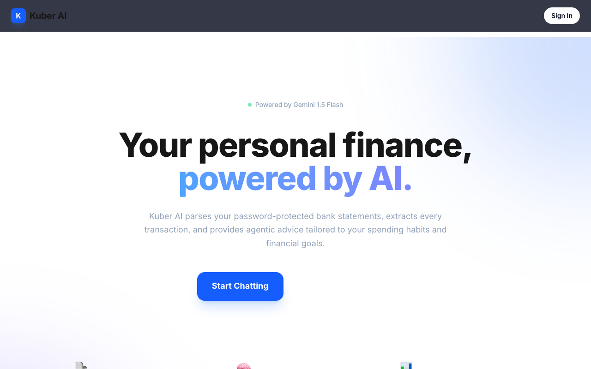

<div align="center">
  <div style="background-color: #2563EB; width: 64px; height: 64px; border-radius: 12px; display: flex; align-items: center; justify-content: center; font-size: 32px; font-weight: bold; color: white; margin: 0 auto 16px auto; box-shadow: 0 10px 15px -3px rgba(37, 99, 235, 0.2);">
    K
  </div>
  <h1>Kuber AI</h1>
  <p><strong>Your Ultimate Agentic Personal Finance Assistant 🚀</strong></p>

  <p>
    <a href="https://nextjs.org/"></a>
    <a href="https://fastapi.tiangolo.com/"></a>
    <a href="https://www.langchain.com/"></a>
    <a href="https://deepmind.google/technologies/gemini/"></a>
    <a href="https://clerk.dev/"></a>
  </p>
</div>

<br/>




**Kuber AI** is a state-of-the-art, multi-agent financial platform that automatically parses locked bank statements and turns them into actionable, persistent insights. Powered by Google's **Gemini 1.5 Flash** and orchestrated dynamically via **LangGraph**, Kuber AI doesn’t just show you charts—it remembers your goals, detects spending anomalies, and chats with you to create personalized savings plans.

***

## 🌟 Key Features

* **Advanced PDF Extraction Engine**: Bypasses context limits via heavily optimized multi-pass LLM chunk extraction. Upload password-protected bank statements and receive perfect line-by-line categorization.
* **Agentic Graph Chat (LangGraph)**: An autonomous AI assistant that fetches your database records dynamically using bound LLM tools to answer specific questions about *your* spending.
* **Persistent Vector Memory (Mem0/Pinecone)**: Remembers your conversations, saving goals, and constraints across sessions to maintain context.
* **Beautiful Dashboard**: Sleek, glass-morphic UI visualizing your income vs. expenses, categorized metrics, and recent statements.
* **Battle-Tested Resilience**: Built-in API key rotation to seamlessly bypass strict free-tier rate limits, plus adaptive JSON parsing recovery algorithms.

***

## 🏗 System Architecture

Kuber AI is split into two strongly isolated layers, built to deploy beautifully on **Vercel** and **Railway**.

### **Frontend** (`/frontend`)
* **Framework**: Next.js 14 (App Router) + React
* **Styling**: Tailwind CSS + Custom CSS Variables
* **Authentication**: Clerk
* **Charts**: Recharts

### **Backend** (`/backend`)
* **Core Framework**: FastAPI + Uvicorn
* **Orchestrator**: LangGraph + LangChain (Google GenAI)
* **Storage**: SQLite3 (`finance.db`)
* **Vector Memory**: Pinecone
* **PDF Engine**: PyMuPDF + Pikepdf

***

## 🚀 Getting Started

### Prerequisites
* Node.js 18+
* Python 3.10+
* Free tier accounts for: Google Gemini Studio, Clerk, and Pinecone.

### 1. Terminal 1: Backend Setup
```bash
cd backend
python -m venv venv
source venv/bin/activate
pip install -r requirements.txt
```

Create a `.env` file in the `/backend` directory:
```env
# Automatic Key Rotation handling Gemini Rate Limits
GEMINI_API_KEY_1=your_gemini_key_here
GEMINI_API_KEY_2=your_gemini_key_here
GEMINI_API_KEY_3=your_gemini_key_here

PINECONE_API_KEY=your_pinecone_key_here
PINECONE_ENV=us-east-1
PINECONE_INDEX_NAME=finance-agent-memory

NEXT_PUBLIC_CLERK_PUBLISHABLE_KEY=pk_test_...
CLERK_SECRET_KEY=sk_test_...

FRONTEND_URL=http://localhost:3000
```
Run the FastAPI Server:
```bash
uvicorn api.main:app --reload
```

### 2. Terminal 2: Frontend Setup
```bash
cd frontend
npm install
```

Create a `.env` file in the `/frontend` directory:
```env
NEXT_PUBLIC_CLERK_PUBLISHABLE_KEY=pk_test_...
CLERK_SECRET_KEY=sk_test_...
NEXT_PUBLIC_CLERK_SIGN_IN_URL=/sign-in
NEXT_PUBLIC_CLERK_SIGN_UP_URL=/sign-up
NEXT_PUBLIC_BACKEND_URL=http://localhost:8000
```
Run the Next.js Client:
```bash
npm run dev
```

***

## 🌐 Endpoints Overview

| Method | Endpoint | Description |
|---|---|---|
| `POST` | `/api/upload` | Decrypts, parses via Gemini, and stores transactions. |
| `GET` | `/api/summary` | Aggregates user totals and pulls categorized transactions. |
| `POST` | `/api/chat` | Invokes the LangGraph Agent pipeline, injecting DB tools. |
| `GET` | `/health` | Basic application liveliness check. |

***

## 🛠️ Roadmap
- [ ] Add CSV direct-importing for credit cards.
- [ ] Integrate SMS parsing (Android companion app).
- [ ] Multi-currency conversion for cross-border statements.

***

<div align="center">
  <sub>Built with ❤️ for modern finance.</sub>
</div>
